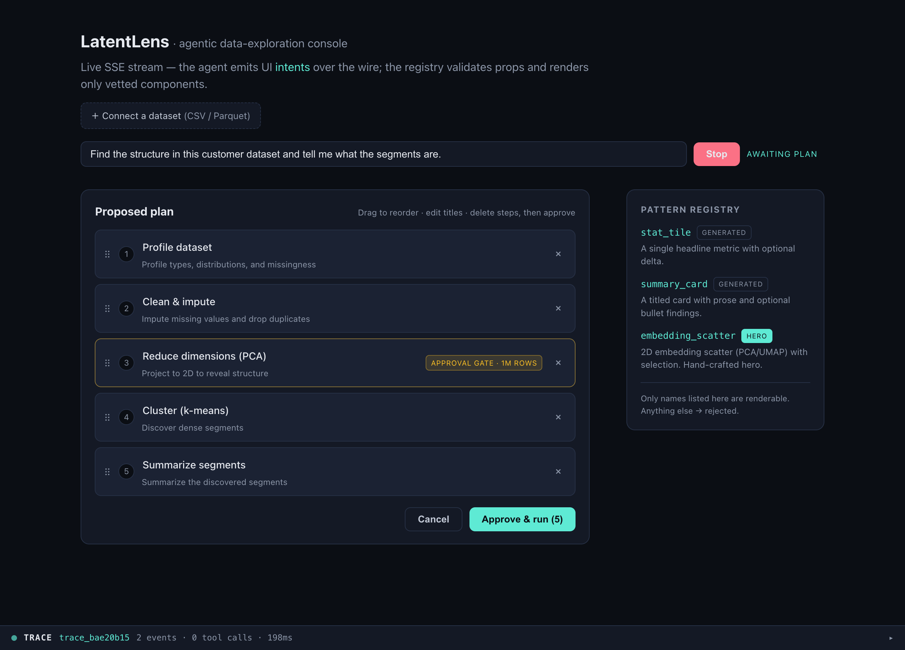
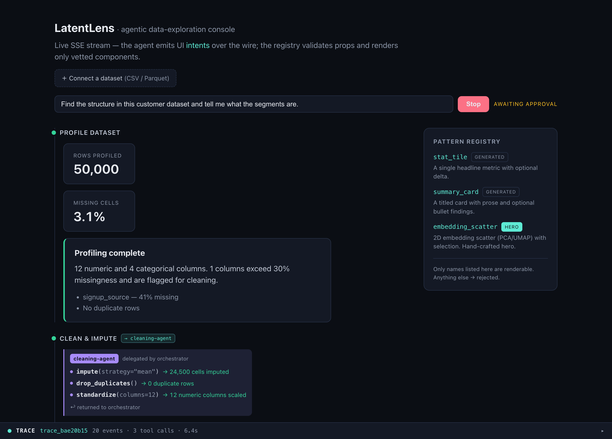
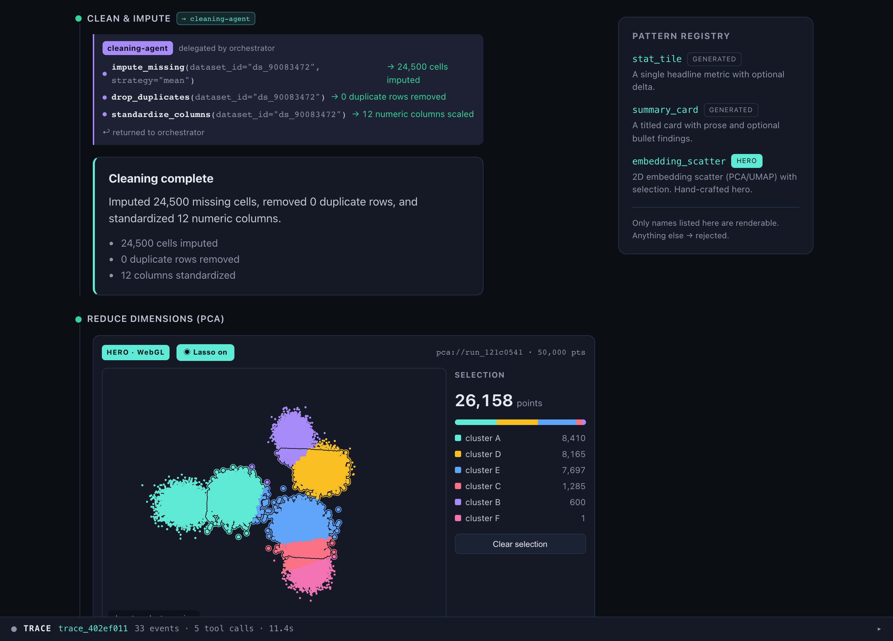
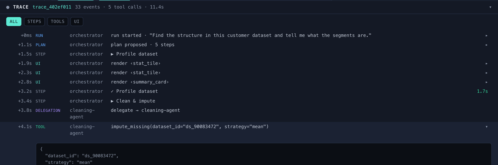
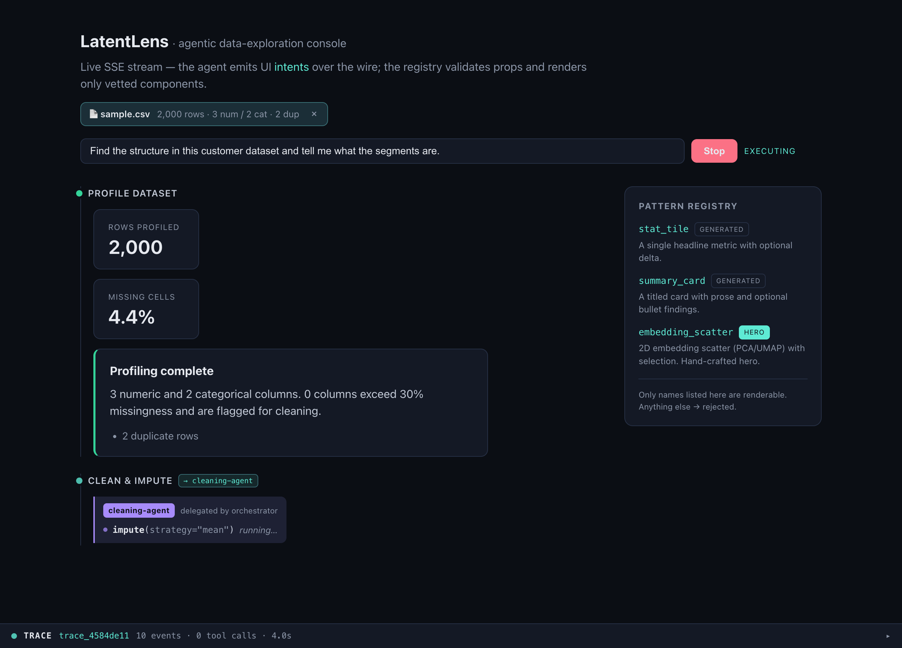

# LatentLens

**An AI agent that explores a dataset by driving an interactive, inspectable UI.**
Generative UI + human-in-the-loop + data viz — built to show *depth*, not glue code.

You give it a goal in plain English ("find the structure in this customer
dataset and tell me what the segments are"). It proposes a plan you can edit,
pauses for your approval before anything expensive, then streams a live
dashboard into existence — profiling cards, a WebGL embedding you can lasso,
named segments — while a trace inspector shows you every event, tool call, and
span that produced it.



---

## The problem

Letting an LLM drive a real UI usually goes one of two bad ways:

1. **The model emits raw HTML/markdown.** Unsafe, unstyleable, unbounded — the
   model can render literally anything, so you can't trust or constrain it.
2. **You reach for a hosted framework** (CopilotKit et al.) that hides exactly
   the part worth understanding.

Two more problems compound it:

- An agent that runs **expensive or irreversible** work (a million-row PCA, a
  spend) shouldn't be fire-and-forget. The human belongs *in* the loop, as
  control flow — not as an after-the-fact undo.
- A capable agent you **can't inspect** is one you can't trust. If you can't see
  what it did and why, "it worked" is a guess.

LatentLens is a from-scratch answer to all three.

## The approach

Three ideas carry the whole project:

### 1 · A constrained generation surface — the Pattern Registry

The agent never emits HTML. It emits a typed **UI intent**: `{ component, props }`.
A registry of vetted patterns is the *only* thing that can render. Props are
validated against a Zod schema at the wire boundary; anything that doesn't match
is **rejected, not rendered**.

```ts
// frontend/src/patterns/registry.ts — one entry = one thing the agent may render
const summaryCard = definePattern({
  name: 'summary_card',
  kind: 'generated',
  schema: z.object({
    title: z.string().min(1),
    body: z.string(),
    bullets: z.array(z.string()).max(8).optional(),
    tone: z.enum(['neutral', 'positive', 'warning']).default('neutral'),
  }),
  component: SummaryCard,
})
// Add a pattern here and it becomes renderable. Nothing else can.
```

The same schemas are exactly what you'd hand the model as its output/tool schema —
so the registry both *steers* generation toward valid intents and *enforces* the
boundary if it strays. Two kinds of pattern: **`hero`** (differentiators built by
hand — the embedding explorer) and **`generated`** (templated utility UI — cards,
tiles) driven from data.

### 2 · Human-in-the-loop as first-class control flow

The run is an **interruptible** stream. Two pause points are built into the
engine, not bolted on:

- **`plan_proposed`** — the agent decomposes the goal into an ordered plan; you
  reorder, rename, or delete steps before it runs.
- **`approval_required`** — before a heavy step (the PCA over ~1M rows) the
  stream *holds* and shows a cost/time estimate. Approve, skip, or cancel.

On the backend these are real LangGraph `interrupt()`s; the SSE stream is held
server-side and resumed by a side-channel `POST` carrying your decision.

### 3 · Trust through observability

Every run carries a `traceId`. A bottom-drawer **trace inspector** folds the
event stream into timestamped spans with durations — `step:` / `tool:` /
`delegation:` start→finish — filterable, click-to-expand raw tool inputs/outputs.
The same instinct as the `/health` version endpoint added after a
[real stale-server incident](POSTMORTEM.md): *a system you can't inspect is a
system you can't trust — whether the "user" is a customer or you at the terminal.*

## Architecture

One wire protocol — the **`AgentEvent` SSE stream** — is the contract between
everything. The frontend speaks it; **two interchangeable backends** speak it
back. Swapping them is a one-line proxy change.

```
┌─────────────────────────── Browser · Vue 3 + TypeScript ───────────────────────────┐
│                                                                                     │
│   useAgentRun ──▶ Pattern Registry ──▶ only vetted Vue components reach the DOM      │
│   (phase state    (Zod-validates          (stat_tile · summary_card ·               │
│    machine)        every {component,props})  embedding_scatter [WebGL hero])         │
│        ▲                                                                             │
└────────┼─────────────────────────────────────────────────────────────────────────┬─┘
         │  SSE: AgentEvent frames (Zod-validated on the wire)                       │
         │  run_started · plan_proposed · step_started · ui_intent ·                 │  POST /api/runs/:id/plan
         │  approval_required · delegation_started · tool_call_* · run_finished       │  POST /api/runs/:id/decision
         │                                                                           ▼  (resume the held gates)
┌────────┴────────────────────── Backend · pick one, same protocol ───────────────────┐
│                                                                                     │
│  ①  FastAPI + LangGraph (real work)          │  ②  Node mock (zero-dep)             │
│     plan ─▶ [plan gate] ─▶ per-step loop:     │     same AgentEvent script,          │
│             start ─▶ [approval gate] ─▶ work  │     no Python needed — the           │
│       · MCP tools: profile/clean/reduce/      │     fastest way to run the           │
│         cluster/summarize (FastMCP)           │     frontend.                        │
│       · numpy ML: PCA (SVD) + k-means         │                                      │
│       · Claude (opus-4-8): planner + summary  │                                      │
│         prose, structured outputs             │                                      │
└─────────────────────────────────────────────────────────────────────────────────────┘
```

**Why two backends?** The Node mock (`frontend/mock/`) means a frontend dev can
run the whole experience with zero Python. The FastAPI service
(`backend/`) is the real thing — it does actual numpy ML over real uploaded data
and calls Claude. Both emit byte-compatible frames, so the frontend never knows
which it's talking to. The protocol is the seam.

| Layer | Tech | Where |
|-------|------|-------|
| Generative UI | Vue 3 `<script setup>`, Zod | `frontend/src/patterns/` |
| Transport | SSE over `fetch` + `ReadableStream` (not `EventSource`, so it can `POST`) | `frontend/src/agent/` |
| WebGL viz | `regl-scatterplot` — pan/zoom + lasso, points fetched **by ref** as binary `Float32` | `frontend/src/patterns/components/EmbeddingScatter.vue` |
| Orchestration | LangGraph `StateGraph`, `interrupt()` gates, `MemorySaver` checkpointer | `backend/app/orchestrator.py` |
| Tools | MCP (FastMCP), connected in-process so tools share the live dataset registry | `backend/app/mcp_tools.py` |
| ML | numpy-only — PCA via SVD, k-means, profiling | `backend/app/ml.py` |
| Reasoning | Claude `claude-opus-4-8`, structured outputs (enum-constrained to the step catalog) | `backend/app/llm.py` |

## What it does — a tour

**Generated UI from typed intents.** Profiling streams in as `stat_tile` and
`summary_card` patterns — the agent chose *what* to show; the registry decided
*whether* it's allowed to.



**A WebGL embedding you can interrogate.** PCA → 2D, k-means → colored segments,
rendered with `regl-scatterplot`. Toggle **Lasso** and drag to select a region;
the selection (count + per-cluster composition) flows back to the agent. "Explain these points"
launches a follow-up run that skips planning and goes straight to an answer —
the lasso→agent→UI loop closing on itself.



**Multi-agent delegation, attributed.** Heavy steps delegate to specialist
sub-agents (`cleaning-agent`, `segmentation-agent`) that invoke **real MCP
tools** — `impute_missing` / `drop_duplicates` / `standardize_columns`,
`run_kmeans` / `label_segments` — each a genuine MCP round-trip over real data.
Those actual calls render as an attributed trace (real args → real results),
color-coded per agent.

**Full observability.** The trace inspector turns the run into something you can
audit: every event with a wall-clock offset, span durations, tool-call args and
results, filterable by step/tool/UI.



**Real data, not a fixture.** Drop in a CSV or Parquet file and the same
pipeline profiles, cleans, and embeds *your* data — real missingness, real
duplicates, real PCA.



## Status & results

The spec's full 5-layer architecture is implemented end-to-end and
browser-verified (Playwright against system Chrome).

- **~2,650 lines** of frontend TypeScript/Vue (11 components), **~1,190 lines**
  of backend Python (11 modules), plus a **~570-line** zero-dep Node mock.
- **Two interchangeable backends behind one Zod-validated protocol** — the
  frontend is unchanged whether it talks to the mock or the real service.
- Everything in the tour above is real and verified: editable plan, approval
  gates, WebGL lasso→follow-up, delegation traces, trace inspector, CSV/Parquet
  upload.

**Honest caveats:**

- **Live Claude needs a funded key.** Planner and summary prose call
  `claude-opus-4-8` with structured outputs; without a key (or with a $0-balance
  account) both fall back to deterministic, goal-aware logic, so the pipeline
  runs fully offline. Set `ANTHROPIC_API_KEY` in `backend/.env` to light up real
  generation. See [`backend/README.md`](backend/README.md).
- The screenshots above are stills; an animated GIF of the lasso→follow-up loop
  is a nice-to-have not yet captured.
- A dropped stream **resumes by runId** (the run keeps executing server-side and
  the client reconnects to replay what it missed), but persistence is in-memory
  (`MemorySaver` + an in-process buffer), so resume doesn't yet survive a process
  restart — a Postgres/SQLite checkpointer + shared buffer is a config swap away.

## Run it

**Prerequisites:** Node LTS (via `nvm`) for the frontend; Python 3.14 for the
real backend.

```bash
# 1 · Fastest path — frontend + zero-dep Node mock (no Python)
cd frontend
nvm use --lts
npm install
npm run dev:all          # Vite :5173 + mock SSE server :8787
open http://localhost:5173

# 2 · The real deal — frontend + FastAPI/LangGraph/MCP backend
cd backend
python3 -m venv .venv && .venv/bin/pip install -r requirements.txt
cp .env.example .env     # optional: add your Anthropic key for live Claude
cd ../frontend
npm run dev:api          # Vite :5173 + uvicorn :8787 (the real backend)

# 3 · Verify in a browser (drives system Chrome, screenshots → e2e/shots/)
npm run verify:browser   # the synthetic plan→approve→explore→lasso flow
npm run verify:upload    # the CSV-upload flow
```

> Heads-up: a stale dev server squatting `:8787` is a known foot-gun — see
> [`POSTMORTEM.md`](POSTMORTEM.md). `pkill -f 'uvicorn|agent-server.mjs|vite'`
> before starting if a run looks wrong.

## Design decisions worth calling out

These are the "why", not the "what" — the choices a reviewer would ask about:

- **Vue over React, on purpose.** The point was to build the generative-UI /
  AG-UI layer *by hand* rather than lean on an off-the-shelf React copilot kit.
  The depth signal is the Pattern Registry, not the framework.
- **Points travel by reference, never as raw arrays over the wire.** The
  `embedding_scatter` intent carries a `pointsRef`; the component fetches the
  cloud as binary `Float32` from `GET /api/points`. Intents stay tiny;
  the wire never carries a megabyte of coordinates.
- **The server owns step *behavior*; the client owns *order*.** A `STEP_CATALOG`
  defines what each step does. You can reorder, rename, and delete steps in the
  plan editor — you can't redefine them. Same constrained-surface principle as
  the Pattern Registry, applied to the plan.
- **Gates are emitted from the interrupt payload, not the node body.** LangGraph
  re-runs an interrupted node when it resumes — so a naive `emit()` inside the
  node would fire twice. The SSE bridge emits gate events from the interrupt's
  value instead. (Learned the hard way; now documented.)
- **One schema, one source of truth.** The Zod `agentEventSchema` on the
  frontend *is* the wire contract; the Python side builds dicts with the exact
  camelCase keys it validates, rather than maintaining a parallel schema that
  could drift.

## Repo layout

```
agentic-explorer/
├── README.md            ← you are here
├── POSTMORTEM.md        ← a real stale-server incident + remediations
├── docs/                ← screenshots used above
├── frontend/            ← Vue 3 + TS app, Pattern Registry, WebGL viz, Node mock
│   ├── src/patterns/    ← the registry (the centerpiece)
│   ├── src/agent/       ← SSE transport, run state machine, HITL components
│   ├── mock/            ← zero-dep Node SSE backend (speaks AgentEvent)
│   └── e2e/             ← Playwright browser verification
└── backend/             ← FastAPI + LangGraph + MCP + numpy ML + Claude
    └── app/             ← orchestrator, mcp_tools, ml, llm, datasets, catalog
```

See [`frontend/README.md`](frontend/README.md) and
[`backend/README.md`](backend/README.md) for layer-specific detail.
